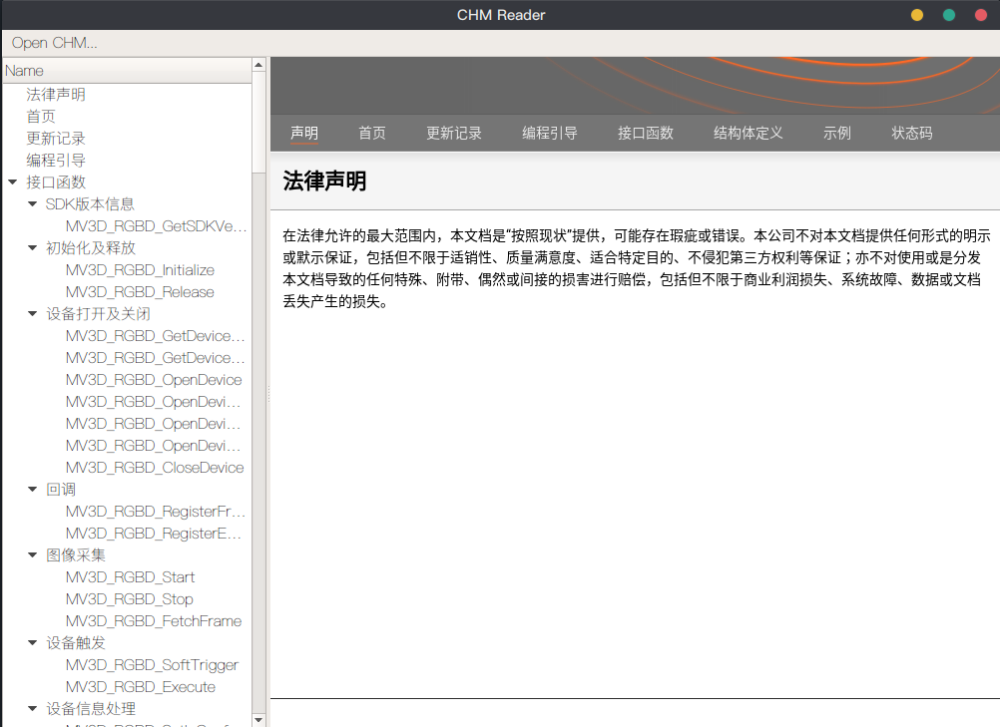

# CHM Reader

一个基于 Qt 5.9 的 CHM（Compiled HTML Help）阅读器，适用于 Ubuntu 18.04。



## 功能特性

- 打开和阅读 CHM 文件
- 使用 7z 解包 CHM 内容
- **智能编码检测** - 自动检测并支持 GBK/GB2312/UTF-8 等编码
- **层级目录树** - 解析 .hhc 文件显示原始目录结构
- 文件树导航 - 如果没有目录文件，按文件夹层级显示
- 使用 QtWebEngine 渲染 HTML 内容
- 自动编码转换 - 将 GBK 编码的 HTML 转换为 UTF-8 以正确显示
- **全文搜索** - 在所有页面中搜索关键词，显示匹配结果和上下文
- **自动清理** - 程序退出时自动清除临时文件

## 依赖

### 系统要求

- Ubuntu 18.04 或更高版本
- Qt 5.9 或更高版本
- CMake 3.1 或更高版本
- p7zip-full（提供 7z 命令）

### 安装依赖

```bash
sudo apt update
sudo apt install qt5-default libqt5webkit5-dev qtwebengine5-dev p7zip-full cmake build-essential
```

**注意**: Ubuntu 18.04 上 Qt 5.9 可能需要以下包：

```bash
sudo apt install qtbase5-dev qtwebengine5-dev libqt5webenginewidgets5
```

## 构建

```bash
# 进入项目目录
cd [parent_dir]/chm_reader

# 创建构建目录
mkdir -p build
cd build

# 配置项目
cmake ..

# 编译
make

# 运行
./chmreader
```

## 使用方法

1. 启动程序后，点击菜单中的 "Open CHM..." 选项
2. 选择一个 .chm 文件
3. 程序会自动解包并显示内容
4. 程序会自动检测文件编码（支持 GBK、GB2312、UTF-8 等）
5. 左侧面板显示搜索框和目录树
6. 点击左侧树节点可以在右侧查看对应内容

### 搜索功能

1. 在左侧顶部搜索框中输入关键词
2. 点击"Go"按钮或按回车键开始搜索
3. 左侧树会切换到搜索结果视图，显示所有包含关键词的页面
4. 每个结果显示页面标题和关键词上下文
5. 点击搜索结果可以打开对应页面，**关键词会自动高亮显示（黄色背景）**
6. 点击"Clear"按钮可以清除搜索，返回原始目录树
7. 搜索是全文搜索，会在所有 HTML 页面的文本内容中查找（自动去除 HTML 标签）
8. 页面会自动滚动到第一个匹配的关键词位置

## 编码支持

本阅读器特别针对**中文 CHM 文件**进行了优化：

- **自动检测编码**：通过分析 HTML meta 标签和字节模式自动识别文件编码
- **支持常见编码**：GBK、GB2312、Big5、UTF-8 等
- **智能转换**：自动将 GBK 编码的内容转换为 UTF-8，确保在 WebEngine 中正确显示
- **无需手动设置**：打开文件后自动处理，无需用户干预

## 注意事项

- 确保系统已安装 p7zip（7z 命令），这是解包 CHM 文件所必需的
- 程序会在系统临时目录创建解包文件，可能占用一定磁盘空间
- 仅支持标准 CHM 格式的文件
- 对于 GBK 编码的 CHM，程序会自动转换，**无需担心乱码问题**

## 故障排除

### 中文显示乱码

- 程序已内置自动编码检测和转换，一般不会出现乱码
- 如果仍有问题，可能是 CHM 文件本身损坏或使用了非标准编码

### 无法打开 CHM 文件

- 检查是否安装了 p7zip: `which 7z`
- 确认 CHM 文件没有损坏

### 编译错误

- 确认 Qt5 WebEngine 已正确安装
- 检查 CMake 输出中是否找到了所有 Qt 组件

### 界面显示异常

- 确保安装了 qtwebengine5-dev 包
- Qt WebEngine 需要较新的图形驱动支持
